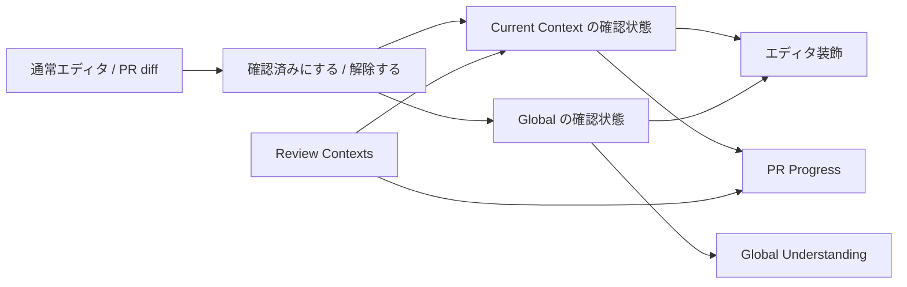
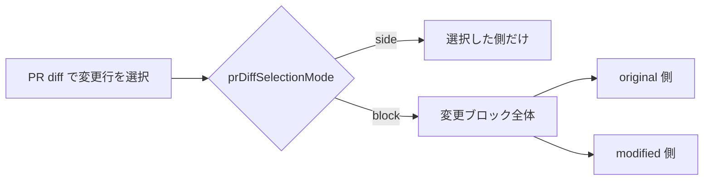

# Review Range Tracker

Review Range Tracker は、VS Code 上で「どの行まで確認したか」を記録し、コードレビューやコード理解の進捗を見えるようにする拡張機能です。

確認済み状態は現在の PR / branch / workspace などの **Context** と、repository 全体で共有する **Global** の両方へ保存されます。VS Code 1.125.0 以上が必要です。

## 現状できること

- 選択した行、カーソル行、ファイル全体を確認済み / 未確認にできます。
- 確認済み行をエディタ上でグレー表示し、ガターや Overview Ruler にも表示できます。
- PR の変更行について、ファイルごとの確認進捗を **PR Progress** で確認できます。
- repository やフォルダーの理解状況を **Global Understanding** で確認できます。
- PR / branch / workspace ごとの確認状態を **Review Contexts** で切り替えて管理できます。
- Git の HEAD 変更やファイル編集後も、変更されていない行は可能な範囲で確認済み状態を引き継ぎます。
- Git 管理外のファイルや Remote / UNC 上のファイルにも対応します。

### 全体像



## インストール方法

Marketplace ではなく VSIX で配布しています。

1. GitHub Releases から最新 Release の `review-range-tracker-<version>.vsix` をダウンロードします。
2. VS Code の拡張機能ビューで `...` を開き、**VSIX からのインストール...** を選びます。
3. ダウンロードした VSIX を指定します。

CLI からインストールする場合は次を実行します。

```powershell
code --install-extension review-range-tracker-<version>.vsix
```

更新時も、新しい VSIX を再インストールしてください。

## 使い方

1. VS Code で対象ファイルを開きます。
2. 確認した行を選択するか、対象行にカーソルを置きます。
3. 右クリックメニューまたはコマンドパレットから **Review Range: 選択範囲を確認済みにする** を実行します。
4. 解除する場合は **Review Range: 選択範囲の確認済みを解除する** を実行します。
5. ファイル全体を対象にする場合は、ファイル全体の確認 / 解除コマンドを使用します。実行前に確認ダイアログが表示されます。
6. Activity Bar の **Review Range** から、Context、PR 進捗、Global 理解率を確認します。

複数 selection がある場合はまとめて処理され、重複・隣接する範囲は正規化されます。

## 4つの View

| View | 役割 |
| --- | --- |
| **Current Context** | 現在選択されている PR / branch / workspace context を表示します。再計算や context の選び直しもここから行えます。 |
| **PR Progress** | 選択中 PR の変更ファイルと確認進捗を表示します。ファイルから PR diff を開くほか、working tree 上の実ファイルを開くこともできます。 |
| **Global Understanding** | repository / folder 単位の理解状況を表示します。folder scope は開始・停止・再開できます。 |
| **Review Contexts** | 現在の PR / branch、保存済み open / closed / merged PR、workspace context を管理します。GitHub PR の再検出、GitHub 再接続、cache 更新、layer 切替、diff 表示などを行えます。 |

## 確認済み状態の考え方

### Context と Global

確認操作は、現在の Context と repository 単位の Global 状態へ一緒に反映されます。

- **Context**: 「この PR / branch / workspace で確認した」という状態です。
- **Global**: 「この repository で既に理解済み」という横断的な状態です。

通常エディタでは Context と Global の両方を使って装飾します。表示上の Global layer は `reviewRange.showGlobalReviewed` で切り替えられます。

### ファイルが変わった場合

Git 管理下では、branch や HEAD が変わったときに commit 間の差分を使って確認済み範囲を移します。

- 変更されていない行は可能な範囲で引き継ぎます。
- 一意に判定できる rename / move は同じファイルとして追従します。
- 変更行や対応が曖昧な行は、確認済みとは扱いません。

Git 管理外の workspace ファイルでは、圧縮 snapshot と行差分を使って再起動後も追従します。snapshot が利用できない場合や対応が曖昧な場合は、保守的に未確認へ戻します。

workspace 外のファイルは external-file context として保存します。Remote workspace や UNC では authority を含む URI を使って識別します。

## PR をレビューする

Current Context で PR context を選択すると、その選択が通常エディタの確認操作と装飾へ反映されます。Review Contexts では保存済み PR の管理や PR diff の表示を行えます。

PR Progress は repository 全体ではなく、対象 PR に含まれる変更ファイルだけを集計します。ファイルを開くと、RevMem が管理する canonical PR diff を diff editor で表示し、通常エディタと同じ確認状態を共有します。

### PR diff の選択単位

`reviewRange.prDiffSelectionMode` で、PR diff 上の確認単位を切り替えられます。

| 値 | 動作 |
| --- | --- |
| `side` | 既定値。選択した original / modified 側だけを確認対象にします。 |
| `block` | 選択した変更行が属する変更ブロック全体を対象にし、存在する original / modified 両側へ展開します。 |



`block` は RevMem が管理する PR diff の選択操作にだけ適用されます。通常エディタ、任意の VS Code diff、ファイル全体の確認 / 解除には適用されません。

## Global Understanding

Global Understanding は、repository や folder の「どこまで理解済みか」を確認するための View です。

folder ごとに scope を開始・停止・再開できます。停止した scope は自動では再開しません。より深い folder scope を、開いたファイルに応じて自動開始したい場合は `reviewRange.globalUnderstanding.autoStartDescendants` を有効にします。

PR Progress と Global Understanding は同じ除外設定 `reviewRange.exclude` を使用します。

除外対象のファイルでも、通常エディタでは確認済みにして状態を保存できます。ただし、PR Progress と Global Understanding の集計には含まれません。

## 保存と履歴

確認状態は対象に応じた VS Code の拡張保存領域へ保存され、VS Code の再起動後も復元されます。

確認 / 解除、context 作成、Git revision mapping などの履歴は JSON Lines 形式で保存します。現在、履歴を閲覧・検索・export する専用 UI はありません。

## 設定

| 設定 | 既定値 | 内容 |
| --- | --- | --- |
| `reviewRange.prDiffSelectionMode` | `side` | PR diff の確認単位を `side` / `block` から選びます。 |
| `reviewRange.showGlobalReviewed` | `true` | Global 確認済み範囲を通常エディタへ重ねて表示します。 |
| `reviewRange.ignoreWhitespaceChanges` | `false` | 空白だけの編集を確認済み範囲の追従で無視します。 |
| `reviewRange.ignoreEolChanges` | `false` | 改行コードだけの編集を確認済み範囲の追従で無視します。 |
| `reviewRange.showGutterIcon` | `true` | 確認済み行のガターアイコンを表示します。 |
| `reviewRange.showOverviewRuler` | `false` | 確認済み範囲を Overview Ruler に表示します。 |
| `reviewRange.globalUnderstanding.autoStartDescendants` | `false` | 開いたファイルより深い Global Understanding scope を自動開始します。停止済み scope は再開しません。 |
| `reviewRange.diagnostics.detailed` | `false` | 再計算理由、処理内訳、対象ファイル名 / path などの詳細診断を Output と進捗 tooltip に表示します。 |
| `reviewRange.exclude` | `**/.git/**`, `**/node_modules/**`, `**/bin/**`, `**/obj/**`, `**/dist/**`, `**/build/**` | PR Progress と Global Understanding の集計対象から除外する glob 配列です。 |
| `reviewRange.maxSnapshotFileSizeBytes` | `5242880` | Git 管理外ファイルの 1 snapshot で許可する圧縮後の最大 byte 数です。 |

`reviewRange.diagnostics.detailed` を有効にするとファイル名や path が診断へ出るため、機密情報を含む repository では出力内容に注意してください。

## 現在の制限

- untitled editor は確認対象にできません。
- 履歴は保存されますが、専用の履歴 UI はありません。
- binary、無効な文字 encoding、`.git` 配下、`reviewRange.exclude` の対象などは PR Progress / Global Understanding の集計対象外です。
- UNC access は VS Code の `security.restrictUNCAccess` と `security.allowedUNCHosts` に従います。拡張機能から制限を迂回しません。
- Git / GitHub / storage の取得や保存に失敗した場合、不確実な結果を確認済みとして採用しません。

実装中タスクや既知課題の詳細は [tasks/tasks-status.md](tasks/tasks-status.md) を参照してください。

## 開発・検証

開発には Node.js 24 を使用します。

```powershell
npm ci
npm run build
npm run typecheck:contracts
npm run validate:architecture
npm run validate:architecture:negative
npm run lint
npm run test:unit
npm test
```

VSIX をローカルで作成する場合は次を実行します。

```powershell
npm run package -- --pre-release --out artifacts/review-range-tracker-0.0.1-pre.vsix
```

pull request の検証では、PR の current HEAD と `head_sha` が一致する成功済み CI run の `review-range-user-validation-<version>` artifact を使用します。

artifact には次が含まれます。

- `review-range-tracker-<version>.vsix`
- 同じ version の tracked source ZIP
- version の解決元、分岐点、HEAD を記録した `version.json`

CI 用 version は、分岐元 main の公開版と PR HEAD の先頭 7 桁を組み合わせます。詳しい規則は [source layout / CI VSIX design](doc/design/source-layout-and-ci-vsix-version.md) を参照してください。

## 詳細仕様

- [VS Code Review Range Tracker 設計](doc/design/vscode-review-range-tracker-design.md)
- [PR diff の確認単位切替](Design/pr-diff-selection-mode.md)
- [Operation diagnostics / refresh scheduling](doc/design/operation-diagnostics-and-refresh-scheduling.md)
- [Source layout / CI VSIX version](doc/design/source-layout-and-ci-vsix-version.md)
- [タスク状況](tasks/tasks-status.md)
