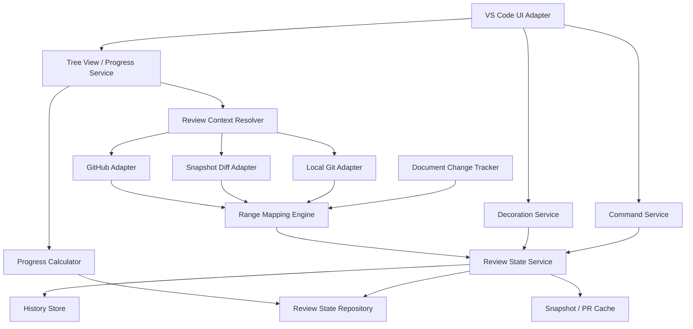

# VS Code レビュー範囲トラッカー 設計書 rev1

- 文書種別: 基本設計・機能設計
- 対象: Visual Studio Code 拡張機能
- 作成日: 2026-07-23
- 仮称: Review Range Tracker
- 状態: 仕様壁打ち反映版

## 1. 概要

本拡張は、コードレビュー中にレビュワーが確認したソースコードの範囲を行単位で記録し、確認済み範囲をエディタ上でグレー表示する。

GitHubなどの既存レビュー画面にはファイル単位の確認済み管理があるが、ファイル内の一部分について「すでに読んだ範囲」を記録する機能がない。長いファイルでは複数の関数や処理を飛び飛びに確認するため、どこまで確認したかをレビュワー自身が見失いやすい。

本拡張は、次の状態管理を提供する。

1. PRまたはブランチごとの確認済み範囲
2. コード変更に追従し、変更部分だけを未確認へ戻す機能
3. 過去の別PR・別ブランチで読んだコードを保持するGlobal確認済み状態
4. PR変更行の確認進捗
5. リポジトリ全体の理解率
6. GitHubに接続できない場合、およびGitリポジトリでない場合のフォールバック動作

## 2. 背景と課題

### 2.1 背景

レビュワーは長いコードを確認するとき、呼び出し元と呼び出し先を往復したり、複数ファイルを行き来したりする。レビューは必ずしも上から下へ直線的に進まない。

既存のファイル単位の確認済みチェックでは、次の情報を保持できない。

- ファイル内のどこを確認したか
- どの範囲が未確認か
- 確認後に変更された範囲はどこか
- 過去の別対応ですでに読んだコードか

### 2.2 解決する課題

本拡張は次の問題を解決する。

- 同じ処理を重複して読み直す
- 確認済みだと思っていた範囲に変更が入っても気づきにくい
- PRの変更行がどこまで確認済みか定量化できない
- 過去に理解したコードの蓄積が可視化されない

### 2.3 解決しない課題

初期版では次を対象外とする。

- レビューコメントの投稿・管理
- GitHub上のApprove、Request changes等のレビュー操作
- 関数、クラス、シンボルを解析した確認操作
- 複数レビュワー間での確認状態共有
- 確認済み理由やメモの入力
- 自動的なレビュー完了判定
- 次または前の未確認変更へのジャンプ
- バイナリファイルの内容レビュー管理

## 3. 設計原則

### 3.1 確実性優先

確認済み表示は、現在のコードが確認時点のコードから変更されていないと確実に判断できる場合だけ適用する。

判断が曖昧な場合は未確認として扱う。

```text
確証あり   -> 確認済み表示
確証なし   -> 未確認表示
追跡不能   -> 未確認表示
```

### 3.2 表示はデフォルトで二値

デフォルトの視覚状態は次の2種類とする。

| 状態 | 表示 |
|---|---|
| 確認済みであることが確実 | グレー背景 |
| 未確認、変更済み、追跡不能、判断が曖昧 | 通常背景 |

内部状態は詳細に保持するが、デフォルトでは色を増やさない。

ユーザー設定により、変更済みや追跡不能へ個別の色を割り当てることは許可する。

### 3.3 言語非依存

確認操作は選択行またはファイル全体だけを対象とする。

関数定義、クラス定義、構文木等には依存しない。これにより、言語ごとの解析実装を不要にする。

### 3.4 PR進捗とGlobal理解率を混在させない

PR進捗は、そのPRの変更行だけを分母とする。

Global理解率は、現在のリポジトリ全体のうち、現在も確認済みと判断できる非空行を分母・分子に用いる。

過去のGlobal確認済み状態をPR進捗へ算入しない。

## 4. 用語

### 4.1 確認済み範囲

ユーザーが確認済みとして登録した、連続する行範囲。

### 4.2 レビューコンテキスト

確認状態を分離する単位。次のいずれかである。

- GitHub PRコンテキスト
- Gitブランチコンテキスト
- Gitなしワークスペースコンテキスト

### 4.3 Global確認済み

特定PRやブランチだけに閉じず、リポジトリ全体で「この内容を過去に確認した」と扱う現在有効な状態。

Globalは「永久に確認済み」という意味ではない。コード変更によって対応範囲が変わった場合、その変更部分は未確認になる。

### 4.4 hunk

Git diffで表現される、連続した変更箇所のまとまり。

例:

```diff
@@ -10,3 +10,4 @@
-old value
+new value
+added line
```

本拡張ではhunkを差分解析の内部単位として利用する。ユーザー操作の単位にはしない。

### 4.5 original側 / modified側

VS Codeのdiff editorにおける次の区分。

- original側: 変更前。削除行を含む
- modified側: 変更後。追加行と現在のコードを含む

## 5. 対象環境

### 5.1 必須対象

- VS Code Desktop
- ローカルワークスペース
- Gitリポジトリ
- GitHub PR
- VS Code diff editor

### 5.2 対応対象

- Remote SSH
- Dev Containers
- GitHub Codespaces
- GitHub未接続のGitリポジトリ
- Git管理されていないワークスペース
- マルチルートワークスペース

拡張はWorkspace Extensionとして動作し、Gitコマンドやファイル操作はワークスペース側のExtension Hostで実行する。

## 6. 機能要件

## 6.1 選択範囲を確認済みにする

ユーザーがエディタで範囲を選択し、コマンドを実行すると、選択範囲を確認済みにする。

### 6.1.1 行単位への正規化

選択が行途中から始まる場合でも、選択に含まれる行全体を対象にする。

例:

```text
5行目の途中から8行目の途中を選択
-> 5〜8行目を確認済み
```

空の選択、すなわちカーソルだけの場合は、カーソルが存在する1行を対象にする。

複数カーソル・複数選択がある場合は、各選択を行範囲へ正規化した後、重複・隣接範囲を結合する。

## 6.2 選択範囲の確認済みを解除する

選択範囲を現在のレビューコンテキストとGlobal確認済みの両方から解除する。

解除により範囲が分断される場合は、残存範囲を分割する。

例:

```text
確認済み: 10〜30
解除:     15〜20

結果:
10〜14
21〜30
```

通常の範囲解除では確認ダイアログを表示しない。

## 6.3 ファイル全体を確認済みにする

現在のファイル全体を確認済みにする。

実行前に確認ダイアログを表示する。

通常エディタでは、現在のファイルに存在する全行を対象にする。

diff editorでは、次を対象にする。

- modified側の全行
- original側にだけ存在する削除行

確認ダイアログ例:

```text
このファイルの全行を確認済みにします。
削除された変更行も確認済みになります。

[確認済みにする] [キャンセル]
```

## 6.4 ファイル全体の確認済みを解除する

ファイルに対する現在のレビューコンテキストとGlobal確認済みをすべて解除する。

diff editorの削除行に対する確認状態も解除する。

実行前に確認ダイアログを表示する。

確認ダイアログ例:

```text
このファイルのすべての確認済み状態を解除します。
Global確認済み状態も解除されます。

[すべて解除] [キャンセル]
```

履歴は削除せず、解除イベントを追記する。

## 6.5 確認済み範囲の重複・隣接結合

重複または隣接する確認済み範囲は自動結合する。

```text
10〜20を確認済み
15〜30を確認済み
-> 10〜30
```

```text
10〜20を確認済み
21〜30を確認済み
-> 10〜30
```

## 6.6 コード変更時の無効化

確認済み範囲に変更が発生した場合、変更部分だけを未確認へ戻す。

変更されていない前後部分は確認済みを維持する。

例:

```text
確認済み: 100〜120
変更:     110〜115

結果:
100〜109 確認済み
110〜115 未確認
116〜120 確認済み
```

追加行は未確認として扱う。

削除行は現在ファイルから消えるが、履歴とdiff editorのoriginal側レビュー対象には残り得る。

## 6.7 PRコンテキスト

GitHub PRを特定できる場合、確認状態をPR単位で保持する。

識別子は次を基礎とする。

```text
GitHubホスト
+ owner
+ repository
+ PR番号
```

base SHAとhead SHAは識別子ではなく、そのPRコンテキストの現在リビジョンとして保持する。

PRへコミットが追加されても、同じPRの確認状態を継続する。

## 6.8 ブランチコンテキスト

GitHub PRを利用できないがGitリポジトリである場合、ブランチ単位で状態を保持する。

識別子は次を基礎とする。

```text
Repository ID
+ 完全なブランチ参照名
```

Detached HEADの場合は、明示的なコミットコンテキストを一時作成する。

## 6.9 Gitなしワークスペースコンテキスト

Gitリポジトリでない場合も基本機能を提供する。

識別子は次を基礎とする。

```text
Workspace URIのハッシュ
+ Workspace folder相対パス
```

Git diffの代わりに、本拡張が保存したスナップショットと現在内容の行差分を使用する。

GitなしのGlobal確認済みは、そのワークスペース内だけで有効とする。

## 6.10 Global確認済みへの自動反映

PR、ブランチ、ワークスペースのいずれで確認操作を行った場合も、同じ範囲をGlobal確認済みへ自動反映する。

```text
PRで確認
-> PR確認状態を更新
-> Global確認済みを更新
-> 履歴を追加
```

```text
確認済み解除
-> 現在コンテキストを解除
-> Global確認済みも解除
-> 履歴を追加
```

Global確認済みは参照カウント方式にしない。ユーザーが解除した範囲はGlobalからも解除する。

## 6.11 複数PRの並列管理

現在のPR以外に、過去のクローズ済みPRをレビューコンテキストとして保持・表示できる。

サイドバーでは複数PRの進捗を並列に表示できる。

エディタ上へ重ねるレビューコンテキストはユーザーが選択する。

デフォルトの有効レイヤーは次とする。

- 現在のPRまたは現在のブランチ
- Global確認済み

クローズ済みPRはデフォルトではエディタ表示レイヤーを無効とし、ユーザーが明示的に有効化する。

クローズ済みPRのコードが現在の作業ツリーに存在しない場合は、そのPR専用のdiff editorで表示する。

## 6.12 diff editor対応

本拡張からPRまたはファイルを開くと、original側とmodified側を持つdiff editorを表示する。

両側で次の操作を利用できる。

- 選択範囲を確認済みにする
- 選択範囲を解除する
- ファイル全体を確認済みにする
- ファイル全体を解除する

original側の削除行も、PR進捗の対象として確認済みにできる。

内部では対象を次のように識別する。

```ts
interface DiffReviewTarget {
  contextId: string;
  fileId: string;
  side: "original" | "modified";
  startLine: number;
  endLine: number;
}
```

拡張が生成する仮想ドキュメントURIには、コンテキスト、ファイル、side、revisionを復元可能な情報を含める。

## 6.13 PR進捗

PR進捗は、そのPRの追加行と削除行だけを分母とする。

```text
PR確認進捗
= 確認済み変更行数 / PRの全変更行数
```

変更前1行を削除し、変更後1行を追加した置換は2行として数える。

未変更の周辺行を確認済みにしても、PR進捗には影響しない。

Global確認済み状態はPR進捗へ算入しない。

### 6.13.1 ファイル単位進捗

各変更ファイルについて次を計算する。

```text
ファイル確認進捗
= そのファイルで確認済みの追加・削除行数
  / そのファイルの追加・削除行数
```

### 6.13.2 未確認変更が残るファイル一覧

PR進捗ビューには、未確認変更が1行以上残るファイルを常時表示する。

表示情報:

- ファイルパス
- 確認済み変更行数
- 全変更行数
- 進捗率
- 追加行数
- 削除行数

ファイルを選択すると、そのPRのdiff editorを開く。

「次の未確認行」へ自動移動は行わない。

### 6.13.3 確認完了ファイル

変更行をすべて確認したファイルは、別の折りたたみ可能なグループへ表示する。

### 6.13.4 rename-onlyファイル

内容変更のないファイル名変更は変更行数が0となるため、行進捗の分母には含めない。

PRビューには「行以外の変更」として表示する。

### 6.13.5 バイナリファイル

バイナリファイルは行進捗から除外し、「行単位レビュー対象外」と表示する。

## 6.14 Global理解率

Global理解率は、現在のリポジトリの対象ファイルに存在する非空行のうち、現在も確認済みと確実に判断できる行の割合とする。

```text
Global理解率
= 現在有効なGlobal確認済み非空行数
  / 集計対象ファイルの全非空行数
```

コメント行は分母へ含める。言語解析を行わないため、コメントと実コードを区別しない。

PR進捗とは別セクションで表示する。

ファイル単位の理解率も表示する。

## 6.15 履歴

履歴は保持するが、初期版では履歴閲覧UIを提供しない。

履歴は追記型イベントとして保存する。

対象イベント:

```ts
type ReviewHistoryEventType =
  | "marked-reviewed"
  | "unmarked-reviewed"
  | "marked-file-reviewed"
  | "unmarked-file-reviewed"
  | "invalidated-by-edit"
  | "remapped-by-diff"
  | "file-renamed"
  | "file-deleted"
  | "context-created"
  | "context-revision-changed"
  | "mapping-unresolved";
```

最低限保存する情報:

- イベントID
- 発生日時
- セッションID
- Repository ID
- Context ID
- revision
- ファイルパス
- diff side
- 変更前範囲
- 変更後範囲
- 理由

現在状態は履歴から毎回再構築せず、別途現在状態を保存する。

## 7. コンテキスト解決仕様

## 7.1 解決優先順位

レビューコンテキストは次の順に解決する。

```text
1. GitHub PR
2. Gitブランチ
3. Gitなしワークスペース
```

### 7.1.1 GitHub PR解決

次の条件を満たす場合、GitHub PRコンテキストを候補とする。

- Gitリポジトリである
- GitHub remoteを識別できる
- GitHub認証セッションを取得できる、または公開リポジトリのAPIを利用できる
- 現在ブランチまたはHEADに対応するPRを取得できる

対応するオープンPRが1件だけの場合は自動選択する。

0件の場合はブランチコンテキストへフォールバックする。

複数件の場合は自動決定せず、ユーザーへ選択を求める。選択されない場合はブランチコンテキストを使う。

### 7.1.2 GitHub未接続

GitHub認証がない、ネットワークに接続できない、APIが失敗した場合もローカルGit機能は継続する。

GitHub接続失敗を理由に、確認済み操作を無効化しない。

### 7.1.3 Git未導入または非Git

Gitコマンドを利用できない場合は、スナップショット差分方式へ移行する。

## 7.2 Repository ID

GitリポジトリのRepository IDは、正規化したremote URLを第一候補とする。

正規化例:

```text
git@github.com:owner/repo.git
https://github.com/owner/repo.git
https://github.com/owner/repo

-> github.com/owner/repo
```

remoteがない場合は、GitリポジトリルートのURIをハッシュ化して使用する。

forkはremoteが異なるため、原則として別Repository IDとする。

## 8. 状態モデル

## 8.1 内部レビュー状態

```ts
type InternalReviewState =
  | "reviewed"
  | "unreviewed"
  | "changed"
  | "deleted"
  | "unresolved";
```

表示上は次のように畳み込む。

```ts
function toDefaultVisualState(state: InternalReviewState): "reviewed" | "normal" {
  return state === "reviewed" ? "reviewed" : "normal";
}
```

## 8.2 範囲モデル

行番号は内部的に0始まり、終了行を含まない半開区間で保持する。

```ts
interface LineInterval {
  startLine: number;
  endLineExclusive: number;
}
```

例:

```text
ユーザー表示: 10〜20行
内部表現:     [9, 20)
```

半開区間により、隣接判定、長さ計算、差分適用を単純化する。

## 8.3 ファイル状態

```ts
interface FileReviewState {
  schemaVersion: number;
  fileId: string;
  currentPath: string;
  previousPaths: string[];
  revisionId: string;

  modifiedReviewed: LineInterval[];
  originalReviewedByDiff: Record<string, LineInterval[]>;

  contentHash?: string;
  lineCount: number;
  updatedAt: string;
}
```

`originalReviewedByDiff`のキーは、PR revisionまたは比較ペアIDとする。

## 8.4 レビューコンテキスト

```ts
type ReviewContextKind = "pull-request" | "branch" | "workspace";

interface ReviewContextState {
  schemaVersion: number;
  contextId: string;
  kind: ReviewContextKind;
  repositoryId: string;
  displayName: string;

  pullRequest?: {
    host: string;
    owner: string;
    repository: string;
    number: number;
    state: "open" | "closed" | "merged";
    title?: string;
    baseSha: string;
    headSha: string;
    url?: string;
  };

  branch?: {
    refName: string;
    baseRevision?: string;
    headRevision: string;
  };

  workspace?: {
    workspaceId: string;
    snapshotRevision: string;
  };

  files: Record<string, FileReviewState>;
  createdAt: string;
  updatedAt: string;
}
```

## 8.5 Global状態

```ts
interface RepositoryGlobalState {
  schemaVersion: number;
  repositoryId: string;
  currentRevisionId: string;
  files: Record<string, GlobalFileReviewState>;
  updatedAt: string;
}

interface GlobalFileReviewState {
  fileId: string;
  currentPath: string;
  revisionId: string;
  reviewed: LineInterval[];
  contentHash?: string;
  updatedAt: string;
}
```

Global状態は現在有効な範囲だけを保持する。過去状態は履歴へ残す。

## 8.6 PR変更モデル

```ts
interface PullRequestFileChange {
  fileId: string;
  oldPath?: string;
  newPath?: string;
  status: "added" | "modified" | "deleted" | "renamed" | "copied" | "binary";
  additions: number;
  deletions: number;
  hunks: DiffHunk[];
}

interface DiffHunk {
  oldStart: number;
  oldCount: number;
  newStart: number;
  newCount: number;
  lines: DiffLine[];
}

interface DiffLine {
  kind: "context" | "addition" | "deletion";
  oldLine?: number;
  newLine?: number;
  text: string;
}
```

## 9. 差分追従アルゴリズム

## 9.1 基本方針

追従は次の順に行う。

```text
1. エディタ編集中の変更イベントで、開いているファイルを即時追従
2. Git revision変更時にGit diffで確定追従
3. Git diffを取得できない場合は保存スナップショットとの差分
4. rename情報でファイルパスを追従
5. 一意に対応できない場合は未確認
```

## 9.2 エディタ編集中の追従

`TextDocumentContentChangeEvent`相当の変更情報を使い、現在開いているファイルの範囲を更新する。

各変更について次を行う。

1. 変更位置より前の確認済み範囲は維持
2. 変更位置より後の範囲は行数差分だけ移動
3. 変更位置と重なる部分は未確認化
4. 挿入行は未確認
5. 変更後も残る前後部分は分割して維持

複数変更は、元ドキュメント上の行番号が大きい順に適用する。

変更後の範囲は即時表示へ反映し、短いデバウンス後に永続化する。

確認操作直後はデバウンスせず、即時永続化する。

## 9.3 Git revision間の追従

確認状態が対応するrevisionを`R_old`、現在revisionを`R_new`とする。

基本コマンド:

```bash
git diff --unified=0 --find-renames R_old R_new -- <path>
```

ブランチのレビュー対象差分を取得する場合はmerge-baseを使用する。

```bash
git diff --unified=0 --find-renames <merge-base> HEAD
```

### 9.3.1 hunkより前の範囲

位置を維持する。

### 9.3.2 hunkより後の範囲

次の差だけ移動する。

```text
lineDelta = newCount - oldCount
```

### 9.3.3 hunkと重なる範囲

旧hunk範囲と重なる確認済み部分を未確認化する。

旧hunkより前と後に残る部分は維持し、後側は新行位置へ移動する。

新hunk内の追加・変更行は未確認とする。

### 9.3.4 追加のみのhunk

挿入された新行は未確認とし、後続確認済み範囲を追加行数分移動する。

### 9.3.5 削除のみのhunk

削除された範囲は現在ファイルのGlobal表示から除外する。

PRコンテキストではoriginal側のレビュー対象として保持できる。

後続確認済み範囲を削除行数分だけ前へ移動する。

## 9.4 ファイルrename・移動

Git diffのrename情報により旧パスと新パスを関連付ける。

次は追従対象とする。

- ファイル名変更
- ディレクトリ移動
- renameと同時に行変更

renameと同時に変更された行は未確認に戻す。

次は自動追従しない。

- 1ファイルから複数ファイルへの分割
- 複数ファイルから1ファイルへの統合
- コピー
- 同一内容が複数候補に存在する移動

コピーは新規ファイルとして未確認から開始する。

## 9.5 rebase・force-push

旧revisionが現在履歴の祖先でない場合、次の順に追従する。

1. 旧revisionのGit objectが存在すれば、旧revisionと新revisionを直接diff
2. Git objectが存在しなければ、保存済みスナップショットと新内容をdiff
3. renameと内容対応が一意なら追従
4. 曖昧なら対象範囲を未確認化

コミットSHAが変わっただけで、全範囲を無条件に解除しない。

## 9.6 空白・改行変更

デフォルトでは次も変更として扱う。

- インデント変更
- 空白数変更
- タブとスペースの変更
- CRLFとLFの変更
- ファイル末尾改行の変更

設定により無視を選択できるようにするが、デフォルトは無視しない。

## 9.7 同一コードの複数候補

内容ハッシュやテキスト検索だけで複数候補が見つかる場合、自動追従しない。

確認済みのコピーを別位置に作成しても、そのコピーは未確認とする。

## 9.8 Gitなしの追従

ファイル確認時、または確認状態を永続化するときに基準スナップショットを保存する。

次回読み込み時にMyers差分等の行差分アルゴリズムを使用して範囲を追従する。

スナップショットが存在しない、破損している、または対応が曖昧な場合は未確認とする。

## 10. 表示優先順位

同じ行へ複数状態が重なる場合、次の順で評価する。

```text
1. 現在PRの未確認変更
2. 追跡不能または変更済み
3. 現在コンテキストで確認済み
4. 有効化された別PRコンテキストで確認済み
5. Global確認済み
6. 未確認
```

デフォルト二値表示では、1、2、6は通常背景、3、4、5はグレー候補となる。

ただし、現在PRの変更行は、そのPRコンテキストで確認済みになった場合だけグレーにする。Global確認済みだけでは現在PR変更行をグレーにしない。

これにより、過去に読んだ付近であっても、今回変更されたコードは必ず再確認対象となる。

## 11. UI設計

## 11.1 Activity Bar

Activity Barに「Review Range」コンテナを追加する。

初期版のビュー:

1. Current Context
2. PR Progress
3. Global Understanding
4. Review Contexts

## 11.2 Current Contextビュー

表示項目:

- 現在のコンテキスト種別
- PR番号、タイトル、状態
- ブランチ名
- base/head revision
- GitHub接続状態
- Global表示の有効・無効

操作:

- 現在コンテキストの切り替え
- PR再検出
- GitHub再接続
- 現在状態の再計算

## 11.3 PR Progressビュー

表示例:

```text
PR #123  67%  40 / 60 lines

未確認変更が残るファイル
  src/Parser.cs        12 / 20
  src/Service.cs        8 / 15
  tests/ParserTests.cs  5 / 10

確認完了したファイル
  src/Models.cs        15 / 15

行以外の変更
  src/OldName.cs -> src/NewName.cs

行単位レビュー対象外
  assets/schema.bin
```

デフォルトの並び順:

1. 未確認行数の降順
2. ファイルパス昇順

切替候補:

- PR上の順序
- パス順
- 未確認行数順
- 進捗率順

## 11.4 Global Understandingビュー

表示項目:

- リポジトリ全体の理解率
- 確認済み非空行数
- 対象非空行数
- ファイルごとの理解率
- 除外ファイル数

PR Progressとは明確に別表示する。

## 11.5 Review Contextsビュー

表示項目:

- 現在のPR
- 現在のブランチ
- 保存済みのオープンPR
- 保存済みのクローズ済みPR
- ワークスペースコンテキスト

各コンテキストに対して次を操作できる。

- 進捗表示
- diffを開く
- エディタ表示レイヤーを有効・無効化
- ローカルキャッシュ更新
- コンテキスト表示から削除

コンテキスト表示から削除しても、履歴削除は別操作とする。

## 11.6 エディタ装飾

確認済み行へ背景装飾を適用する。

デフォルト:

- ライトテーマ: 低彩度の半透明グレー
- ダークテーマ: 低彩度の半透明グレー
- Overview Ruler: デフォルト無効
- ガターアイコン: デフォルト有効

装飾はテーマ別設定を許可する。

ホバー表示例:

```text
確認済み
Context: PR #123
Reviewed at: 2026-07-23 09:30
Global: active
```

変更済みや追跡不能の内部情報は、デフォルト色を変えずにホバーまたはログで確認できる。

## 11.7 Status Bar

表示例:

```text
PR #123: 67% | Global: 42%
```

PRコンテキストがない場合:

```text
branch/feature-x | Global: 42%
```

Gitなしの場合:

```text
Workspace review | Global: 18%
```

## 11.8 コマンド

| Command ID | 表示名 | 確認ダイアログ |
|---|---|---|
| `reviewRange.markSelectionReviewed` | 選択範囲を確認済みにする | なし |
| `reviewRange.unmarkSelectionReviewed` | 選択範囲の確認済みを解除する | なし |
| `reviewRange.markFileReviewed` | ファイル全体を確認済みにする | あり |
| `reviewRange.unmarkFileReviewed` | ファイル全体の確認済みを解除する | あり |
| `reviewRange.openPullRequestDiff` | PRのdiffを開く | なし |
| `reviewRange.refreshContext` | レビュー状態を再計算する | なし |
| `reviewRange.selectContext` | レビューコンテキストを選択する | なし |
| `reviewRange.toggleGlobalLayer` | Global表示を切り替える | なし |
| `reviewRange.manageContextLayers` | 表示PRを選択する | なし |

コマンドはCommand Paletteとエディタのコンテキストメニューへ登録する。

## 12. アーキテクチャ



## 12.1 UI Adapter

責務:

- VS Codeコマンド登録
- エディタ選択範囲取得
- 確認ダイアログ表示
- diff editor表示
- Tree View更新
- Status Bar更新

## 12.2 Review Context Resolver

責務:

- ワークスペース内のGitリポジトリ検出
- Repository ID解決
- 現在ブランチ・HEAD取得
- GitHub PR候補取得
- フォールバックコンテキスト生成

## 12.3 Review State Service

責務:

- 範囲追加
- 範囲解除
- 重複・隣接結合
- コンテキスト状態更新
- Global状態更新
- 履歴生成
- 永続化要求

## 12.4 Range Mapping Engine

責務:

- 編集イベントによる範囲変換
- Git diffによる範囲変換
- スナップショットdiffによる範囲変換
- rename追従
- 曖昧判定

本コンポーネントはVS Code APIやGitHub APIに依存しない純粋ロジックとして実装する。

## 12.5 Progress Calculator

責務:

- PR全体進捗
- ファイル別PR進捗
- 未確認変更ファイル抽出
- Global理解率
- ファイル別Global理解率

## 12.6 GitHub Adapter

責務:

- GitHub認証セッション取得
- PR情報取得
- PRファイル一覧取得
- base/head SHA取得
- クローズ済みPR取得
- 必要なファイル内容またはblob取得

認証トークンは本拡張の永続ストレージへ保存しない。

## 12.7 Local Git Adapter

責務:

- Git利用可否判定
- リポジトリルート検出
- remote取得
- branch・HEAD取得
- merge-base取得
- diff取得
- rename検出
- Git object存在判定
- 指定revisionのファイル内容取得

Gitコマンド実行は引数配列で行い、シェル文字列連結を使用しない。

## 12.8 Snapshot Diff Adapter

責務:

- Gitなし時のスナップショット作成
- Git object欠落時の補助スナップショット利用
- 行差分計算
- 圧縮・復元
- 保存期限管理

## 13. GitHub PRデータ取得

## 13.1 基本経路

PRメタデータはGitHub APIから取得する。

変更行の内容は次の優先順で取得する。

1. base/head commitがローカルGitに存在する場合、ローカル`git diff`
2. GitHubのPR files APIが返すpatch
3. patchが欠落または不完全な場合、base/headのファイル内容を取得してローカル差分計算

APIだけを唯一の差分ソースにはしない。

## 13.2 オフライン動作

取得済みPRはローカルキャッシュから表示する。

GitHubへ接続できなくても、ローカルにbase/head objectが存在すればPR差分と進捗を更新する。

新しいPR情報を取得できない場合は、UIに最終更新日時を表示する。

## 14. 永続化設計

## 14.1 保存先

GitリポジトリおよびGitHub PRの状態は、`ExtensionContext.globalStorageUri`配下へ保存する。

Gitなしワークスペース固有の状態は、`ExtensionContext.storageUri`配下へ保存する。

小さいインデックス情報やUI選択状態は`globalState`または`workspaceState`へ保存する。

大きな状態、履歴、スナップショットはファイルとして保存する。

## 14.2 ディレクトリ構成

```text
globalStorageUri/
  repositories/
    <repository-id-hash>/
      manifest.json
      global-state.json
      contexts/
        <context-id>.json
      history/
        events-YYYY-MM.jsonl
      snapshots/
        <content-hash>.json.gz
      cache/
        github/
        diffs/
      lock
```

Gitなしの場合:

```text
storageUri/
  workspace-state.json
  history/
  snapshots/
  lock
```

## 14.3 書き込み方式

現在状態は次の手順でアトミックに更新する。

1. 一時ファイルへ書き込む
2. flushする
3. 既存ファイルと置換する

履歴はJSON Lines形式で追記する。

同一リポジトリを複数VS Codeウィンドウで開いた場合に備え、排他ロックを行う。

ロックは排他的ファイル作成と期限切れ判定を使用する。

## 14.4 スキーマ移行

全保存モデルに`schemaVersion`を持たせる。

拡張起動時に、旧スキーマから新スキーマへ段階的に移行する。

移行前にはバックアップを作成する。

## 14.5 保存量管理

現在状態と有効な確認証跡は保持する。

中間スナップショットと古いキャッシュは整理対象とする。

デフォルト方針:

- 履歴: 無期限保持
- Gitで再取得可能なファイル全文: 原則保存しない
- Gitなしスナップショット: 現在状態の追従に必要な世代を保持
- GitHub APIキャッシュ: 期限付き
- 大容量スナップショット: 上限超過時に保存せず、そのファイルは再起動後に未確認へ倒す

## 15. 設定

初期設定案:

```json
{
  "reviewRange.showGlobalReviewed": true,
  "reviewRange.ignoreWhitespaceChanges": false,
  "reviewRange.ignoreEolChanges": false,
  "reviewRange.showGutterIcon": true,
  "reviewRange.showOverviewRuler": false,
  "reviewRange.exclude": [
    "**/.git/**",
    "**/node_modules/**",
    "**/bin/**",
    "**/obj/**",
    "**/dist/**",
    "**/build/**"
  ],
  "reviewRange.maxSnapshotFileSizeBytes": 5242880,
  "reviewRange.historyRetentionDays": 0,
  "reviewRange.closedPullRequestLayerDefault": false,
  "reviewRange.decorations.changed.enabled": false,
  "reviewRange.decorations.unresolved.enabled": false
}
```

`historyRetentionDays = 0`は無期限保持を表す。

色は`configurationDefaults`またはテーマ対応可能な設定として提供する。

## 16. 集計対象外

### 16.1 常に対象外

- バイナリファイル
- `.git`配下
- VS Code内部仮想ドキュメントのうち、本拡張が管理しないもの

### 16.2 デフォルト対象外

- `.gitignore`に一致するファイル
- 依存ライブラリ
- ビルド成果物
- 一般的な生成出力ディレクトリ

### 16.3 ユーザー指定除外

glob設定により、生成コード、ロックファイル、minify済みファイル等を除外できる。

除外設定変更後はGlobal理解率を再計算する。

PR進捗では、GitHub/Git上の変更ファイルを基準とするが、ユーザー除外対象は「除外」と明示し、分母から除く。

## 17. 状態更新タイミング

## 17.1 即時更新

- 選択範囲の確認
- 選択範囲の解除
- ファイル全体確認
- ファイル全体解除
- 開いているファイルの編集

## 17.2 Git状態更新時

- commit
- checkout
- branch変更
- pull
- merge
- rebase
- reset
- GitHub PR head更新
- ファイルrename・delete

HEAD監視はVS Codeのファイル監視と定期的な軽量確認を組み合わせる。

## 17.3 遅延・遅延読み込み

- リポジトリ全体のGlobal理解率はバックグラウンドで段階計算する
- 開いているファイルを優先する
- PRファイル一覧はTree View展開時まで詳細diff解析を遅延できる
- 装飾はvisible editorだけに適用する

## 18. エラー処理

## 18.1 基本方針

エラーによって確認済みと誤表示することを避ける。

処理失敗時は次のどちらかとする。

- 直前の確実な状態を維持し、古い可能性を通知する
- 対応範囲を未確認へ戻す

どちらを選ぶかは、状態の確実性によって決める。

## 18.2 Gitエラー

- Git未導入: スナップショット方式
- revision不明: スナップショット方式または未確認
- diff parse失敗: 対象ファイルを未確認
- rename曖昧: 旧ファイル履歴を保持し、新ファイルは未確認

## 18.3 GitHubエラー

- 認証失敗: ブランチコンテキストへフォールバック
- API rate limit: キャッシュ利用
- ネットワーク失敗: ローカルGitを利用
- PR patch欠落: ファイル内容を取得して差分計算
- 全経路失敗: 取得済み状態を古い状態として表示し、進捗更新を停止

## 18.4 保存エラー

確認操作をメモリ上だけ成功扱いにしない。

永続化に失敗した場合はエラーを表示し、再試行を行う。

再試行に失敗した場合は、そのセッションでの一時状態であることを明示する。

## 19. セキュリティとプライバシー

- GitHubトークンは本拡張がファイルへ保存しない
- VS Codeの認証APIからセッションを取得する
- ソースコードとスナップショットを外部サービスへ送信しない
- GitHub APIへ送信するのはGitHub連携に必要なリポジトリ・PR要求だけとする
- スナップショットはローカル拡張ストレージへ保存する
- ログには認証情報とソース本文を出力しない
- private repositoryのパス、PRタイトル等を診断ログへ出す場合は設定で抑止可能にする

## 20. パフォーマンス要件

初期目標:

- 選択範囲確認後の装飾反映: 100ms以内を目標
- 1ファイルの編集追従: 通常サイズで入力体感を阻害しない
- visible editor以外の装飾計算を行わない
- 1万変更行規模のPRでもTree Viewを段階表示する
- リポジトリ全体理解率の計算でExtension Hostを長時間占有しない

対策:

- Intervalの正規化済み配列を使用
- 二分探索で対象範囲を検索
- 差分適用をファイル単位で行う
- 進捗値をキャッシュする
- 大規模計算をチャンク分割する
- GitHub APIとファイル内容をキャッシュする

## 21. テスト方針

## 21.1 単体テスト

### Interval操作

- 範囲追加
- 重複結合
- 隣接結合
- 部分解除
- 全解除
- 0行ファイル
- 最終行選択

### 差分追従

- 変更より前
- 変更より後
- 一部重複
- 全体重複
- 挿入
- 削除
- 置換
- 複数hunk
- 連続commit
- CRLF/LF
- 空白のみ変更

### rename

- 100% rename
- renameと一部変更
- コピー
- 分割相当
- 複数候補

### 進捗

- 追加だけ
- 削除だけ
- 置換
- 未変更周辺行の確認
- Global確認済みがPR進捗へ入らないこと
- binaryとrename-only

## 21.2 統合テスト

- 一時Gitリポジトリを作成
- PR相当のbase/headを作成
- 確認範囲登録
- commit追加
- rebase
- rename
- force-push相当の履歴変更
- branch切替
- 複数リポジトリ
- Gitなしフォルダ

## 21.3 VS Code Extension Hostテスト

- 通常エディタの装飾
- diff editor両側の選択
- コンテキストメニュー
- ファイル全体操作の確認ダイアログ
- Tree View更新
- Status Bar更新
- 再起動後の復元
- 複数ウィンドウの保存競合

## 21.4 障害系テスト

- Gitコマンド失敗
- GitHub 401/403/404/429
- APIレスポンスのpatch欠落
- 保存容量不足
- JSON破損
- スナップショット破損
- 途中終了
- stale lock

## 22. 受け入れ条件

初期版の完了条件を次とする。

1. 任意の選択行を確認済みにできる
2. 確認済み行がグレー表示される
3. 選択行の確認済みを解除できる
4. 重複・隣接範囲が結合される
5. 一部解除で範囲が分割される
6. ファイル全体確認・解除で確認ダイアログが出る
7. Git commit追加後、未変更行は確認済みを維持する
8. 変更行だけ未確認に戻る
9. rename後も未変更部分が追従する
10. 曖昧な移動・コピーを確認済みにしない
11. GitHub PR単位で確認状態を分離できる
12. GitHubなしでブランチ単位に動作する
13. Gitなしでワークスペース単位に動作する
14. diff editorのoriginal側とmodified側で確認操作できる
15. 削除行をPR進捗へ含められる
16. PR進捗が追加・削除行だけを分母にする
17. 未確認変更が残るファイル一覧を表示できる
18. Global理解率をPR進捗と別表示できる
19. PRで確認した範囲がGlobalへ反映される
20. 解除操作がGlobalにも反映される
21. クローズ済みPRを並列管理できる
22. 履歴が保存されるが、履歴UIは存在しない
23. 再起動後に状態を復元できる
24. エラー時に不確実な範囲を確認済み表示しない

## 23. 初期版で実装しない機能

- 関数・クラス単位の確認
- Language ServerやASTとの統合
- メモ
- 確認理由
- レビュワー名
- チーム共有
- GitHubレビューコメント
- Approve連携
- 次・前の未確認変更へ移動
- 自動完了判定
- 履歴閲覧UI
- コピーされたコードの自動確認済み継承
- クラウド経由のGlobal状態同期

## 24. 将来検討

### 24.1 メモ

確認済み範囲へ短いメモを付与する。

例:

- 入力検証を確認
- 例外経路を確認
- 呼び出し元と整合

初期版では実装しない。

### 24.2 誰が確認したか

チーム共有を導入する場合、確認者ID、確認日時、共有範囲を記録する。

初期版では個人ローカル状態だけを扱う。

### 24.3 履歴UI

次を可視化する。

- いつ確認したか
- どのcommitで確認したか
- どの変更で未確認へ戻ったか
- 範囲がどのように移動したか

### 24.4 外部保存・同期

GitHub Checks、GitHub App、専用サーバー等によるチーム共有を検討する。

ソースコード断片を外部へ保存しない方式を優先する。

### 24.5 言語解析

ユーザー需要が確認できた場合のみ、関数単位操作を別機能として追加する。

コアの行単位モデルは維持し、言語解析は選択範囲を生成する補助層に限定する。

## 25. 実装フェーズ案

### Phase 1: ローカル行範囲管理

- 通常エディタ
- 選択範囲確認・解除
- ファイル全体確認・解除
- 装飾
- Interval操作
- ワークスペース永続化

### Phase 2: 編集・Git diff追従

- 編集イベント追従
- commit間diff
- rename
- branchコンテキスト
- 履歴

### Phase 3: diff editorとPR進捗

- 仮想ドキュメント
- original/modified両側
- 追加・削除行進捗
- 未確認ファイル一覧

### Phase 4: GitHub PR連携

- GitHub認証
- PR検出
- open/closed PR取得
- PRキャッシュ
- 複数PR並列管理

### Phase 5: Global理解率

- Global状態
- リポジトリ全体集計
- 除外設定
- パフォーマンス最適化

### Phase 6: Gitなし・堅牢化

- スナップショットdiff
- rebase/force-push
- ストレージ整理
- 複数ウィンドウ排他
- 障害系対応

## 26. 参考資料

- [Visual Studio Code Extension API](https://code.visualstudio.com/api/references/vscode-api)
- [Visual Studio Code Extension Common Capabilities](https://code.visualstudio.com/api/extension-capabilities/common-capabilities)
- [Git diff documentation](https://git-scm.com/docs/git-diff)
- [Git diff format](https://git-scm.com/docs/diff-format)
- [GitHub REST API endpoints for pull requests](https://docs.github.com/en/rest/pulls)

