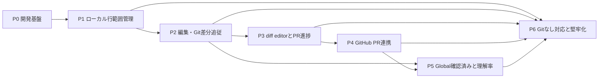

# Review Range Tracker フェーズ計画

> 更新ルール: このファイルは `task-breakdown-planner`、`task-consistency-manager`、または `progress-sync-manager` を通してのみ更新する。

## 計画の前提

- 設計根拠: `doc/design/vscode-review-range-tracker-design.md` rev1
- 対象成果物: TypeScriptで実装するVS Code Desktop向けWorkspace Extension
- 開発単位: 原則として1タスクを1コミット・1PRで完了できる大きさにする
- 実装方法: 挙動実装では失敗するテストを先に追加し、実装後に単体、統合、またはExtension Hostテストで終了条件を証明する。環境・scaffold-onlyタスクはテスト適用可否と後続test harnessの担当範囲を明示する
- 確実性原則: 対応関係を一意に証明できない範囲は確認済みにしない
- 初期版対象外: 設計書23章の機能は本計画に含めない

## 規模の目安

| 規模 | 目安 | 意味 |
| --- | --- | --- |
| S | 0.5〜1日 | 単一コンポーネント内で完結する変更 |
| M | 2〜3日 | 複数モジュールまたは1種類の統合試験を含む変更 |
| L | 4〜5日 | 外部API、Extension Host、永続化などの境界をまたぐ変更 |

見積もりは実装着手前に再確認し、Lを超える見込みになった場合は`task-breakdown-planner`で再分解する。

## フェーズ一覧

| Phase | 状態 | マイルストーン | タスク | 依存Phase | 終了条件 |
| --- | --- | --- | --- | --- | --- |
| P0 | 完了 | 開発基盤 | T001〜T003 | なし | 拡張機能をビルドでき、単体・統合・Extension Hostテストの最小経路がローカルとCIで動く |
| P1 | 完了 | ローカル行範囲管理 | T101〜T108 | P0 | 通常エディタで確認・解除・装飾・再起動復元が動き、現時点の機能をVSIXとして配布・導入でき、AC-01〜AC-06とAC-23のローカル部分を満たす |
| P2 | 進行中 | 編集・Git差分追従 | T201〜T207 | P1 | 編集、commit、branch、renameに追従し、変更箇所だけが未確認になる。AC-07〜AC-10とAC-12を満たす |
| P3 | 未着手 | diff editorとPR進捗 | T300〜T306 | P2 | original/modified両側を操作でき、追加・削除行だけを使う進捗と除外を含むファイル一覧が表示される。AC-14〜AC-17を満たす |
| P4 | 未着手 | GitHub PR連携 | T401〜T406 | P3 | PR検出、取得フォールバック、オフラインキャッシュ、複数PR管理が動く。AC-11とAC-21を満たす |
| P5 | 未着手 | Global確認済みと理解率 | T501〜T506 | P2、P4 | Global状態の同期、表示優先順位、非空行集計、除外設定が動く。AC-18〜AC-20を満たす |
| P6 | 未着手 | Gitなし対応と堅牢化 | T601〜T608 | P1〜P5 | Gitなし、履歴改変、移行、排他、障害、性能の試験を通し、AC-13、AC-22〜AC-24を含む24件すべてを満たす |

## P0 開発基盤

### 目的

後続タスクが同じビルド、テスト、モジュール境界、fixtureを再利用できる状態を作る。

### 終了チェックポイント

- `package.json`とlockfileがGit追跡対象になっている
- VS Code拡張機能を起動できる最小manifestとactivation entry pointがある
- core層がVS Code API、GitHub API、ファイルシステムへ直接依存しない
- 単体、Git fixture統合、Extension Hostの各テストを1件以上実行できる

## P1 ローカル行範囲管理

### 目的

外部Git・GitHub連携なしで、現在のファイルに対する確認操作と永続化を成立させる。

### 終了チェックポイント

- 複数選択を半開区間へ正規化し、重複・隣接範囲を結合できる
- 部分解除で範囲が分割され、コンテキスト状態と保存状態が一致する
- ファイル全体操作だけ確認ダイアログを表示する
- 通常エディタの確認済み行をグレー背景とガターで識別できる
- Git・PR状態は`globalStorageUri`、Gitなし状態は`storageUri`へ保存し、VS Code再起動後に確実な状態だけを復元する
- background snapshot保存をdebounceし、確認・解除は即時保存する
- deactivationがpending保存と受付済み永続化操作を待つ
- 同じworkspaceとuser-dataを使う3回のExtension Host起動で、確認状態と解除状態の装飾復元を確認する
- GitHub ReleaseからVSIXを入手してインストールでき、現時点の機能と操作方法を日本語READMEで確認できる

## P2 編集・Git差分追従

### 目的

行編集とGit revision変更に対して、未変更部分を維持しつつ変更部分だけを無効化する。

### 現在の進捗

- T201 Range Mapping EngineはPR #7で実装・検証済み
- T202 Local Git AdapterはPR #8で実装・検証済み
- PR #7とPR #8は最新`main`へ未統合であり、T203着手前に追従・統合と同一base上の全試験が必要

### 終了チェックポイント

- 編集イベントの複数変更を後方から適用し、範囲を正しく移動・分割できる
- remote URLまたはroot URIから安定したRepository IDを解決できる
- branch、detached HEAD、commit更新を別コンテキストとして安全に扱える
- renameは一意な場合だけ追従し、copy・分割・統合・複数候補は未確認にする
- 空白・EOL変更を既定では変更扱いとし、設定時だけ無視できる
- 追記型履歴と現在状態が矛盾しない

## P3 diff editorとPR進捗

### 目的

ローカルbase/head比較を使い、GitHub接続前でもPR相当のdiff操作と進捗計算を完成させる。

### 終了チェックポイント

- 仮想URIからcontext、file、side、revisionを復元できる
- original側の削除行とmodified側の追加行を個別に確認・解除できる
- 置換を削除1行と追加1行として数え、未変更行とGlobal状態を分子へ混入させない
- ユーザー除外をPR進捗の分母から外し、未確認、完了、除外、rename-only、binaryのグループを仕様どおり表示する

## P4 GitHub PR連携

### 目的

GitHub接続を追加しつつ、認証・ネットワーク・API失敗がローカルレビュー機能を停止させない構成にする。

### 終了チェックポイント

- 認証sessionまたは公開repositoryの未認証APIでPRを検出し、open PRが1件なら自動選択、複数なら選択、0件または未選択ならbranchへフォールバックする
- 差分取得をlocal Git、PR patch、base/head内容の順で試行する
- トークンを独自保存せず、秘密情報やソース本文をログへ出さない
- open/closed/merged PRを保存し、現在の表示レイヤーを選択できる
- オフライン時は最終更新時刻付きキャッシュを使う

## P5 Global確認済みと理解率

### 目的

コンテキスト固有の確認状態とGlobal状態を同期し、PR進捗とは分離した理解率を提供する。

### 終了チェックポイント

- 確認と解除が現在コンテキストとGlobalへ同一トランザクションで反映される
- 現在PRの未確認変更行がGlobalだけで確認済み表示にならない
- バイナリ、gitignore、生成物、ユーザーglobを集計から除外できる
- 現在有効な非空行だけでリポジトリ・ファイル理解率を計算できる
- 大規模集計をチャンク化し、visible editorと開いているファイルを優先する

## P6 Gitなし対応と堅牢化

### 目的

フォールバック経路、履歴改変、ストレージ障害、並行実行、大規模データを含む初期版の受け入れ条件を閉じる。

### 終了チェックポイント

- Git未導入・非Gitではworkspace IDと保存スナップショット差分で動作する
- rebase・force-push後も証拠がある範囲だけを追従し、曖昧な範囲を未確認にする
- スキーマ移行前バックアップ、破損データ隔離、stale lock回復が動く
- マルチルート、Remote SSH、Dev Containers、Codespaces相当のURI境界を扱える
- 1万変更行規模でもUIを段階表示し、Extension Hostを長時間占有しない
- 設計書22章の受け入れ条件24件を自動試験または明示的な手動試験で証明する

## Phase間の依存関係

