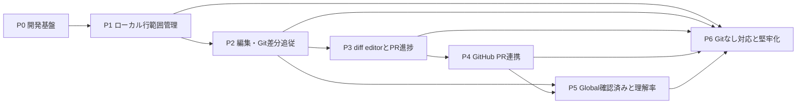

# Review Range Tracker フェーズ計画

> 更新ルール: このファイルは `task-breakdown-planner`、`task-consistency-manager`、または `progress-sync-manager` を通してのみ更新する。

## 計画の前提

- 設計根拠: `doc/design/vscode-review-range-tracker-design.md` rev4
- 対象成果物: TypeScriptで実装するVS Code Desktop向けWorkspace Extension
- 開発単位: 原則として1タスクを1コミット・1PRで完了できる大きさにする
- 実装方法: 挙動実装では失敗するテストを先に追加し、実装後に単体、統合、またはExtension Hostテストで終了条件を証明する
- 確実性原則: 対応関係を一意に証明できない範囲は確認済みにしない
- 恒久設計: task名やPR経緯を設計本文へ入れず、単一の設計書へ機能別に統合する

## 規模の目安

| 規模 | 目安 | 意味 |
| --- | --- | --- |
| S | 0.5〜1日 | 単一コンポーネント内で完結する変更 |
| M | 2〜3日 | 複数モジュールまたは1種類の統合試験を含む変更 |
| L | 4〜5日 | 外部API、Extension Host、永続化などの境界をまたぐ変更 |

Lを超える見込みになった場合は再分解する。

## フェーズ一覧

| Phase | 状態 | マイルストーン | タスク | 依存Phase | 終了条件 |
| --- | --- | --- | --- | --- | --- |
| P0 | 完了 | 開発基盤 | T001〜T003 | なし | build、unit、Git fixture、Extension Hostの最小経路がローカルとCIで動く |
| P1 | 完了 | ローカル行範囲管理 | T101〜T109、T104-2 | P0 | 通常editorで確認・解除・装飾・永続化・restart復元・VSIX配布が動く |
| P2 | 進行中 | 編集・Git差分追従 | T201〜T207 | P1 | edit、commit、branch、renameに追従し、変更部分だけ未確認になる |
| P3 | 進行中 | diff editorとPR進捗 | T300〜T306 | P2 | original/modified両side、変更行進捗、除外・未確認file一覧が動く |
| P4 | 未着手 | GitHub PR連携 | T401〜T406 | P3 | PR検出、取得fallback、offline cache、複数PR管理が動く |
| P5 | 未着手 | Global確認済みと理解率 | T501〜T506 | P2、P4 | Global同期、表示優先順位、非空行集計、除外設定が動く |
| P6 | 未着手 | Gitなし対応と堅牢化 | T601〜T608 | P1〜P5 | Gitなし、履歴改変、移行、排他、障害、性能を含む全受け入れ条件を満たす |

## P0 開発基盤

### 目的

後続機能が同じbuild、test、module boundary、fixtureを再利用できる状態を作る。

### 終了チェックポイント

- reproducibleな依存管理がある
- VS Code拡張を起動できるmanifestとentry pointがある
- core層がVS Code、GitHub、filesystemへ直接依存しない
- unit、Git integration、mock GitHub、Extension HostをCIで実行できる
- architecture positive/negative gateを独立CI stepとして実行できる
- CI失敗時に原因調査用artifactを保存できる

## P1 ローカル行範囲管理

### 目的

外部Git・GitHub連携なしで、現在fileに対する確認操作、装飾、永続化を成立させる。

### 終了チェックポイント

- 複数選択を半開区間へ正規化し、重複・隣接を結合できる
- 部分解除とfile全体操作が正しい
- 確認済み行をtheme対応で表示できる
- Git/PR状態とGitなし状態を適切なstorageへ保存する
- restart後に確実な状態だけを復元する
- main更新ごとのVSIX prereleaseを配布できる

## P2 編集・Git差分追従

### 目的

編集とGit revision変更に対して、未変更部分を維持しつつ変更部分だけを無効化する。

### 現在の進捗

- T201 Range Mapping Engineは統合・検証済み
- T202 Local Git Adapterは統合・検証済み
- T203 diff parserとrevision interval mappingは統合・最終レビュー済み
- 次の実装対象はT204 rename・directory move・deleteのfile state適用

### 終了チェックポイント

- editの複数変更を正しく移動・分割できる
- remoteまたはroot URIからstable Repository IDを解決できる
- branch、detached HEAD、commit更新を安全に扱える
- renameは一意な場合だけ追従する
- whitespace/EOLは既定で変更扱い、設定時だけ無視する
- historyとcurrent stateが矛盾しない

## P3 diff editorとPR進捗

### 目的

ローカルbase/head比較を使い、GitHub接続前でもPR相当のdiff操作と進捗計算を完成させる。

### 現在の進捗

- T300 共通除外policyは最終レビュー済み
- T302はcontext、file、filesystem semantics、side、immutable revisionを復元する仮想URIとcontent providerを実装済み
- Git missing/fatal分離、exact path、raw blob、fatal UTF-8、4 MiB超、actual `vscode.Uri`、public contractを検証済み
- metadata/blob共通Node runtime、Windows予約名、明示blob boundary、統一timeout errorを検証済み
- 恒久仕様は`doc/design/vscode-review-range-tracker-design.md` rev4の1fileへ機能別統合している
- 設計依存行列、Composition Root、Current Context、PR Progress、Review Contextsの既決要件をcontract testで固定した
- レビューR5でdesign testを通常unit/focused suiteへ直接接続した
- architecture positive/negative gateを独立CI stepとして追加し、各logをfailure artifactへ保存する
- blob timeoutはpartial stdout/stderrを保持し、close待機、SIGTERM、SIGKILL escalation、bounded failureを扱う
- R5 follow-upと最終再レビューではblocking・non-blocking findingなし
- T302完了によりT303とT405のURI依存が解消した
- 全体の次タスクはP2のT204

### 終了チェックポイント

- 仮想URIからcontext、file、filesystem semantics、side、immutable revisionを復元できる
- Local Git metadataとblobが同じruntime executable・timeoutを使用する
- process timeout時のpartial diagnosticと終了lifecycleを保持する
- design/architecture contractが通常CIで実行される
- original削除行とmodified追加行を確認・解除できる
- 置換を削除と追加として数え、GlobalをPR進捗へ混入させない
- 未確認、完了、除外、rename-only、binary/encoding対象外を分類表示する

## P4 GitHub PR連携

### 目的

GitHub接続を追加しつつ、認証・network・API障害がローカルレビューを停止させない構成にする。

### 終了チェックポイント

- 認証sessionまたはpublic APIでPRを検出する
- local Git、PR patch、base/head contentの順で差分取得する
- tokenとsource本文を不要に保存・log出力しない
- open/closed/merged PRを保存し、表示layerを管理できる
- offline時は更新日時付きcacheを使用する

## P5 Global確認済みと理解率

### 目的

context確認状態とGlobalを同期し、PR進捗と分離した理解率を提供する。

### 終了チェックポイント

- 確認・解除がcontextとGlobalへatomicに反映される
- 現在PR未確認変更をGlobalだけで確認済みにしない
- binary、gitignore、生成物、user globを共通policyで除外する
- current valid non-empty lineだけで理解率を計算する
- 大規模集計をchunk化する

## P6 Gitなし対応と堅牢化

### 目的

fallback、履歴改変、storage障害、並行実行、大規模dataを含む初期版の受け入れ条件を閉じる。

### 終了チェックポイント

- Git未導入・非Gitでsnapshot diffが動く
- rebase・force-push後も証拠がある範囲だけ追従する
- migration backup、破損隔離、stale lock回復が動く
- multi-root、Remote SSH、Dev Containers、Codespaces境界を扱える
- 1万変更行規模でもUIを段階表示する
- 設計書21章の受け入れ条件を自動または明示的手動試験で証明する

## Phase間の依存関係

```mermaid
flowchart LR
    P0["P0 開発基盤"] --> P1["P1 ローカル行範囲管理"]
    P1 --> P2["P2 編集・Git差分追従"]
    P2 --> P3["P3 diff editorとPR進捗"]
    P3 --> P4["P4 GitHub PR連携"]
    P2 --> P5["P5 Global確認済みと理解率"]
    P4 --> P5
    P1 --> P6["P6 Gitなし対応と堅牢化"]
    P2 --> P6
    P3 --> P6
    P4 --> P6
    P5 --> P6
```
